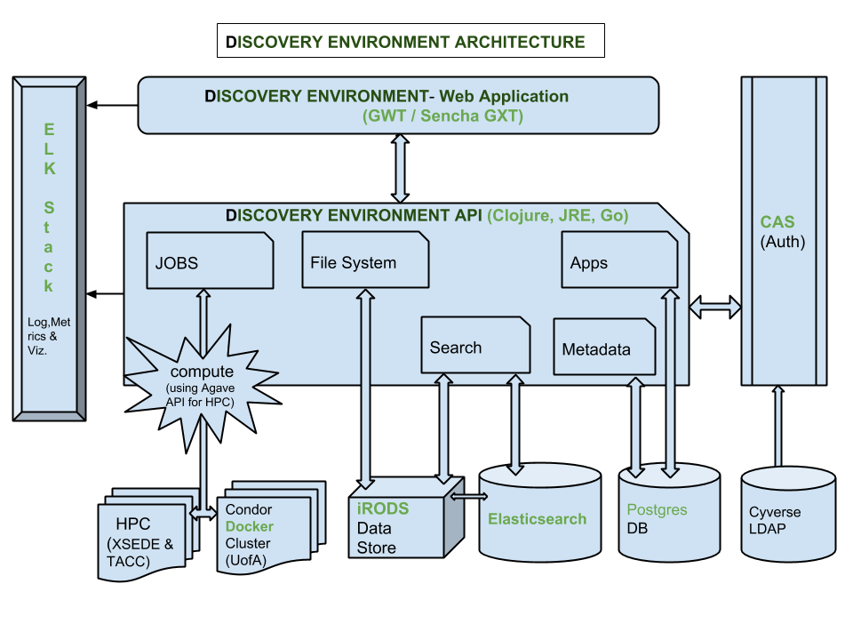

.. include:: cyverse_rst_defined_substitutions.txt
.. include:: custom_urls.txt

|CyVerse_logo|_

|Home_Icon|_

`Learning Center Home <http://learning.cyverse.org/>`_

Discovery Environment
---------------------

**Description:**

After you have created your CyVerse account and been granted access to the visual interactive computing environment (VICE) portion of the Discovery Environment data science workbench, you'll be able to start a GUI based app.

|de_architecture|

**Figure:** More than you wanted to know about how this stuff works.

|Discovery Environment Guide|

..
	#### Comment: short text description goes here ####

----

*The Data Store*
~~~~~~~~~~~~~~~~

The CyVerse Data Store uses `iRODS <https://irods.org>`_ as a cloud storage system. When you see the data in the browser, it looks like a conventional file tree with folders and filenames. 

CyVerse started out with the project name "iPlant Collaborative", and our data store still retains the ``iplant`` zone name in iRODS.

   .. admonition:: Windows vs Linux

      If you're a Windows user, you're used to your file path looking something like this:

         ::

           C:\Documents\Folder Name\File Name.pdf
      
      The volume or drive is assigned a letter, e.g. ``C:\``, and there may be spaces in the folders and file names.

      In Linux, the folder paths use a forward slash ``/`` , and do not add a letter to the root volume name. Spaces in folders and file names are highly discouraged and are unusable on the command line as a space is a special character which separates arguments.   

         ::

           /home/username/documents/folder_name/file_name.pdf
      
      Using special case `styles <https://medium.com/better-programming/string-case-styles-camel-pascal-snake-and-kebab-case-981407998841>`_ like ``camelCase``, ``snake_case``, ``PascalCase``, or ``kebab-case`` helps to differentiate between words in folder and filenames.

|Data Store Guide|

*Walkthrough*
============

**1.** Log into the Discovery Environment: `https://de.cyverse.org <https://de.cyverse.org>`_

**2.** Click the |data_button| icon labeled "**Data**"  

**3.** This opens a file explorer, in your personal username space

  |data_window|
   
   Your space has a path in the data store, e.g.
   
   .. code :: 
     
     /iplant/home/username
   
   This is your personal space, it is private to you. 

   You can create new folders and upload or download files. 

   You can change the permissions of these files and folders to share them with your collaborators or the public.
   
**4.** Create a new folder called ``agpi_workshop``

   The new folder should be located:
   
   .. code ::
   
      /iplant/home/username/agpi_workshop
      
   This folder is private, only you can see it.   

**5.** Sharing a folder

   Click on the 'Share' tab and 'Share with Collaborators' option.
   
   Type in a user's given name and it should be searched and pop up. You will not see their ``username``, only their identity and institution information.
   
   You have three options in granting privileges to others: ``read`` ``write`` or ``own``
   
   * ``read`` permissions allows the users to see and download the files and folder
   
   * ``write`` permissions allows the user to modify the file and folder name.
   
   * ``own`` permissions allows the user to modify the file and folder **and the ability to create and delete**
   
   Type in 'Public User' -- adding this user will share the directory with all other CyVerse users when they are authenticated.
   
   Type in 'Anonymous User' -- adding this user will share the directory with the open internet (it will become visible on the internet via `https://data.cyverse.org/dav-anon/ <https://data.cyverse.org/dav-anon/>`_

**6.** Look into the Community Data folder

   These are public folders that have been 'shared' with all CyVerse users or with the open internet (via the Anonymous User group): 
   
   .. code ::
   
      /iplant/home/shared/
      
   Navigate to 'agpi_workshop/' and 'data/'
   
   .. code :: 
          
      /iplant/home/shared/agpi_workshop/data
   
   There are some sample datasets in here that we'll get to later in the workshop.
   
   There are many more Community Data folders in CyVerse that you cannot see -- that's because they have not been shared with the 'Public' or 'Anonymous' user groups.

   You do not have ``write`` or ``own`` permission on any Community folders, so you cannot change them.

**7.** Look into the 'Shared with Me' folder

   These folders are private user accounts that have public data in them or have been shared with you personally. 

**8.** Access the Data Store from Cyberduck (Windows and Mac OS X only)
   
   Download |Cyberduck| program onto your local computer.
   
   Add the |Cyberduck Profile| file to your installation. This will request your CyVerse credentials.
   
   View the contents of your Data Store. Drag and drop files and Cyberduck will upload / download them for you.
   
**9.** Access the Data Store from WebDav (browser based)

   In your browser, navigate to `https://data.cyverse.org <https://data.cyverse.org>`_
   
   WebDav is a read-only space for viewing data that are already in the data store
  
   The ``https://data.cyverse.org/dav/`` folder path requires authentication with your CyVerse username and password
   
   The ``https://data.cyverse.org/dav-anon/`` folder path is public and anonymous read only to anyone on the interent. 

   .. admonition:: Where does your data live?

     When you download data from the internet to your local computer they're isolated. How do you share them back with your team?

     Many of us use services like `Box <https://box.com>`_ or `Google Drive <https://drive.google.com>`_ to hold our files. `CyberDuck <https://cyberduck.io>`_ and its command line client `duck.sh <https://duck.sh>`_ also access these platforms. 

     These services are incredibly useful. 

     However, file storage and sharing platforms like Box and Drive were not designed for machine readability and rapid requests for many (i.e. thousands to millions) of requests by anonymous users or even by trusted users. (see `Google Drive vs Google Cloud <https://suitebriar.com/blog/google-cloud-vs-google-drive>`_ for an explanation)
     
     Conventional file services like ``ftp://`` (file transfer protocol), function over HTTP and HTTPS. The same is true for Amazon Web Services ``s3`` storage object buckets. (`S3 explained <https://dzone.com/articles/confused-by-aws-storage-options-s3-ebs-amp-efs-explained>`_)
     
   .. admonition:: How to work with your data in CyVerse 
   
     Downloading data from commercial cloud storage providors directly into CyVerse Data Store requires you have a running instance (virtual machine, or container in Discovery Environment) where the data can be staged before moving them onto the Data Store.
     
     Uploading data to CyVerse is dependent upon your local internet service provider. 
     
     
*The App Catalog*
~~~~~~~~~~~~~~~~~

If you signed up for the workshop, you will have already been added to the AG2PI Community group.  We have added a couple of apps that have all of the tools needed for the workshop.

These Apps are yours to use! You can install new packages and software into them, but if that becomes too time consuming, consider learning about how to integrate your own Tools and Apps using the |Apps and Tool Guide|.

*TERMINOLOGY*
+++++++++++++

**App** -- a graphical interface for starting a "Tool" here in the Discovery Environment. The App window can be customized to use any set of conditionals, parameters, resource requirements, input data, or output folders needed to do your analysis. An App can be "**interactive**" like the RStudio or Jupyter Lab, "**executable**" like a command line script, or "**OSG**" for high throughput parallel computing on the Open Science Grid.

**Tool** -- a "Tool" is a Docker container which has been added to the Discovery Environment tool manager. It must be public on the Docker Hub or another Docker Registry (e.g. quay.io, NVIDIA NGC, etc.). After the tool manager template has been completed, the container will be added to the Discovery Environment. Click the "Manage Tools" with the wrench icon in the Apps window, to add your containers. After the Tool is integrated a private App can be created. 

*Walkthrough*
============

**9.** Click the |apps_button| icon labeled **Apps** 

**10.** Under **Categories** and "My Apps" and "My Communities" you should see a group called NEON

|neon_community|

**11.** In the group are a couple of shared apps with the |beta| tag. 

  In the next section, we're going to go over starting one of these apps, and beginning an Analysis, which you can view using the |analyses_button| icon labeled 'Analyses'

*Analyses*
~~~~~~~~~~

*Walkthrough*
============

**12.** Click the |analyses_button| icon labeled **Analyses**

**13.** In the next section, we'll cover running your own Analysis. When you start an "App" the running analysis will appear in the |analyses_button|

----

**Description of output and results**

You should now understand the basics of the Classic Discovery Environment Interface.

   - Data Store
   - Apps
   - Analyses

----

**Fix or improve this documentation**

- Search for an answer:
  |CyVerse Learning Center|
- Ask us for help:
  click |Intercom| on the lower right-hand side of the page
- Report an issue or submit a change:
  |Github Repo Link|
- Send feedback: `learning@CyVerse.org <learning@CyVerse.org>`_

----

|Home_Icon|_
`Learning Center Home <http://learning.cyverse.org/>`_

.. Comment: Place Images Below This Line
   use :width: to give a desired width for your image
   use :height: to give a desired height for your image
   replace the image name/location and URL if hyperlinked

 .. |Clickable hyperlinked image| image:: ./img/IMAGENAME.png
    :width: 500
    :height: 100
 .. _CyVerse logo: http://learning.cyverse.org/

 .. |Static image| image:: ./img/IMAGENAME.png
    :width: 25
    :height: 25

.. Comment: Place URLS Below This Line

   # Use this example to ensure that links open in new tabs, avoiding
   # forcing users to leave the document, and making it easy to update links
   # In a single place in this document

   .. |Substitution| raw:: html # Place this anywhere in the text you want a hyperlink

      <a href="REPLACE_THIS_WITH_URL" target="blank">Replace_with_text</a>

.. |Data Store Guide|  raw:: html

   <a href="https://learning.cyverse.org/projects/data_store_guide/en/latest/" target="blank">Data Store Guide</a>

.. |analyses_button| image:: ./img/de/analyses_icon.png
    :width: 25
    :height: 25

.. |apps_button| image:: ./img/de/apps_icon.png
    :width: 25
    :height: 25

.. |data_button| image:: ./img/de/data_icon.png
    :width: 25
    :height: 25

.. |data_window| image:: ./img/de/data_window.png
    :width: 400

.. |neon_community| image:: ./img/de/neon_my_community.png
    :width: 400

.. |Cyberduck|  raw:: html

   <a href="https://cyberduck.io/" target="blank">Cyberduck</a>

.. |Cyberduck Profile|  raw:: html

   <a href="https://learning.cyverse.org/projects/data_store_guide/en/latest/step1.html" target="blank">Cyberduck Profile</a>
   

.. |Apps and Tool Guide| raw:: html

   <a href="https://learning.cyverse.org/en/latest/tools_and_apps.html" target="blank">Apps and Tool Guide</a>

.. |workspace-geospatial-latest| image:: https://de.cyverse.org/Powered-By-CyVerse-blue.svg
.. _workspace-geospatial-latest: https://de.cyverse.org/de/?type=quick-launch&quick-launch-id=b19b3b00-0b6f-4c28-9d0f-23c965264309&app-id=580bbc6e-161e-11eb-880c-008cfa5ae621

.. |rstudio-geospatial-3.6.3| image:: https://de.cyverse.org/Powered-By-CyVerse-blue.svg
.. _rstudio-geospatial-3.6.3: https://de.cyverse.org/de/?type=quick-launch&quick-launch-id=abce1ed0-8fb4-4cc5-bef3-3a9530446dc6&app-id=1903c788-1947-11eb-8f3e-008cfa5ae621

.. |Github Repo Link|  raw:: html

   <a href="https://github.com/CyVerse-learning-materials/2020-neon-aop-workshop" target="blank">Github Repo Link</a>

