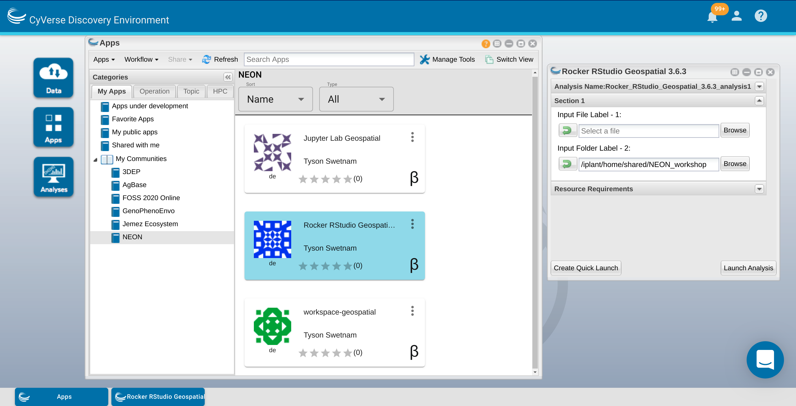

.. include:: cyverse_rst_defined_substitutions.txt
.. include:: custom_urls.txt

|CyVerse_logo|_

|Home_Icon|_
`Learning Center Home <http://learning.cyverse.org/>`_

Your Workbench
--------------

**Description:**

We have integrated several Docker containers into the CyVerse Discovery Environment workbench |VICE| platform, and made them "Public" for anyone with a CyVerse account to use.

We have also copied some of the AG2PI example data sets to the CyVerse Data Store

In this section, we're going to walk through the required steps of starting an interactive analysis, and shutting it down when you're done.

|Discovery Environment Guide|

..
	#### Comment: short text description goes here ####

----

*Starting a VICE app*
~~~~~~~~~~~~~~~~~~~~~

**1.** Log into the Discovery Environment `https://de.cyverse.org <https://de.cyverse.org>`_

 Or click this quick launch button to be taken directly to the app:

   - RStudio: |rstudio-verse-3.6.3|_

**2.** Click the |apps_button| 'Apps' button and a new window should open.

   Search using the query "rstudio verse" and see what comes up.

   |apps_search|

   Also, under the "My Apps" tab click on the "My Communities" section and "AG2PI" Group should appear.

   Click on the Hyperlinked name and a new window should open.

**3.** In the pop-up for the particular App you have a few options.

  **i.**   ``Analysis Name`` - you can change the name of the analysis if you like, the default name is typically ``<the-app-name>_analysis1``

   Your analysis will run, and when it completes, it will write any data that you have in the WORKING DIRECTORY of the container back to the Data Store in your Analyses folder, e.g. ``/iplant/home/<username>/analyses/<the-app-name>_analysis1-<DATE-TIME-of-job-starting>``

  **ii.** The second section is ``Input Data`` and has options for adding (1) a folder, (2) a single file, or (3) multiple files.

   For our use case today, we're going to add a folder from the data store.

  |add_data_window2|

   Add the path: ``/iplant/home/shared/NEON_workshop/``

  |add_data_window1|

    .. admonition:: Input Data (not required)

     When you launch a new VICE app, you can add data to it before it is launched. If you do this, it will slow down the launch, as the service must copy the data from the data store into your new instance before it becomes available.

     A faster option is to start the container without the data, and then copy the data into the running container later using WebDav, iCommands, or a file system mount.

   **iii.** The third section is ``Resource Requirements``, again you can leave the default settings, or you can modify them.

   You can set the ``Minimum CPU`` to the minimum number of cores your app requires. If you do not select anything, the app will still be able to use multiple cores on the shared node on which it is deployed.

   You can set the ``Minimum RAM`` to the minimum number of GB of RAM you think your app requires.

   You can set the ``Minimum Disk Space`` to the minimum amount of scratch space you think your data will need.

   **iv.** After you've set the analysis name, input data, and resource requirements, click ``Launch Analysis``

    Watch closely, you'll see a notification at the top of your screen and in the Bell icon in the upper right.

**4.** Open the |analyses_button| icon labeled "Analyses" to view your running analysis.

    Look for your App by Name.

    See the square icon with an arrow pointed up to the right? Click on that icon and a new browser tab will open.

    |analyses_window|

    Alternately, click the Bell icon in the upper right to see your notifications, you should see 'Access your running analysis here.' as an option. Click on that link and a new browser tab will open.

**5.** Having clicked on either of the hyperlinked icons in Step 4 should result in a new tab opening in your browser.

   Your Discovery Environment Browser tab should still be open at ``https://de.cyverse.org/de/``

   The new URL for the App should be something like ``https://af7664685.cyverse.run/``.

   Your app is now ready for you to begin work.

**6.** Return to your Discovery Environment Browser tab.

   On the right side of the Analysis window there is an icon |dots| with three vertical dots. Click on that icon.

   You have multiple options available here:

   |analyses_options|

   ``Go to output folder`` will take you to the output folder in your ``/analyses`` Data store path. This output folder will not exist until AFTER you end the running analysis.

   ``View Logs`` will show you the echo of the container job starting -- this is very useful for debugging containers that are not acting appropriately.

   ``View Parameters`` will show you the parameters you set when launched -- good for reviewing stopped containers.

   ``Relaunch`` -- if you have stopped your analysis, you can re-launch it with the same parameters as before. Useful for coming back to a second or third day.

   ``View Analysis Info`` will show you the status and Analysis ID -- this is useful when asking for support from the CyVerse team.

   ``Share with Collaborators`` you can share your running analysis with other CyVerse users or team members.

   ``Complete and Save Outputs`` **DANGER Zone** -- when you click this, your job will be stopped and your analysis results will be copied to the ``/analyses`` folder

   ``Cancel`` **DANGER Zone** -- when you click this, your job will be stopped and your results will not be written back to the data store.

   ``Delete`` -- this option is only available after you have stopped your App and want to remove the information from your Analysis window

   ``Rename`` You can rename your analysis

   ``Update Comments`` You can update your comments about your analysis.

*Stopping a VICE app*
~~~~~~~~~~~~~~~~~~~~~

**1.** After you've finished working on your instance, it is conscientious to shut down your analysis and free up share resources for other researchers.

**2.** Make sure that your data that you've copied into the running Analysis have been moved to another storage location on the internet, or back into your data store in another file path.

**3.** Analysis data that are in the single working directory "WORKDIR" of the container that the App has set in its configuration file will be saved back to the Data Store in your ``/iplant/home/<username>/analyses/<the-app-name>_analysis1-<DATE-TIME-of-job-starting>`` folder.

**4.** When the job ends, any data that are in other ``/temp`` or ``/home/username`` folders in the running App WILL NOT BE SAVED or written back to the Data Store.

**5.** Click on the icon with the three vertical dots or select the app with the check box and click on the ``Analyses`` buton in the upper left of the Analyses window.

   ``Complete and Save Outputs`` **DANGER Zone** -- when you click this, your job will be stopped and your analysis results will be copied to the ``/analyses`` folder

   ``Cancel`` **DANGER Zone** -- when you click this, your job will be stopped and your results will not be written back to the data store.

**6.** Depending on how much data you have in the WORKDIR folder of the running App, the analysis may take a few minutes to complete and shut down.

**7.** When the Analysis completes, you will now have the option to Delete the finished job.

----

**Description of output and results**

**IMPORTANT:** These data are currently running in a virtual machine, which will soon be going away, either when it times out, or you turn it off. You need to make sure that your data are moved to a data repository, like the CyVerse Data Store, or downloaded to your localhost, before you turn this analysis off.

Any data which are in the working directory of ``/iplant/home/<username>/analyses/<the-app-name>_analysis1-<DATE-TIME-of-job-starting>`` directory). Any data which are in other paths will not be preserved

----

**Fix or improve this documentation**

- Search for an answer:
  |CyVerse Learning Center|
- Ask us for help:
  click |Intercom| on the lower right-hand side of the page
- Report an issue or submit a change:
  |Github Repo Link|
- Send feedback: `learning@CyVerse.org <learning@CyVerse.org>`_

----

|Home_Icon|_
`Learning Center Home <http://learning.cyverse.org/>`_

.. Comment: Place Images Below This Line
   use :width: to give a desired width for your image
   use :height: to give a desired height for your image
   replace the image name/location and URL if hyperlinked

 .. |Clickable hyperlinked image| image:: ./img/IMAGENAME.png
    :width: 500
    :height: 100
 .. _CyVerse logo: http://learning.cyverse.org/

 .. |Static image| image:: ./img/IMAGENAME.png
    :width: 25
    :height: 25

.. Comment: Place URLS Below This Line

   # Use this example to ensure that links open in new tabs, avoiding
   # forcing users to leave the document, and making it easy to update links
   # In a single place in this document

   .. |Substitution| raw:: html # Place this anywhere in the text you want a hyperlink

      <a href="REPLACE_THIS_WITH_URL" target="blank">Replace_with_text</a>

.. |analyses_button| image:: ./img/de/analyses_icon.png
    :width: 25
    :height: 25

.. |apps_button| image:: ./img/de/apps_icon.png
    :width: 25
    :height: 25

.. |dots| image:: ./img/de/dots.png
    :width: 25
    :height: 25

.. |apps_search| image:: ./img/de/apps_search.png
    :width: 400

.. |analyses_window| image:: ./img/de/analyses_window.png
    :width: 400

.. |analyses_options| image:: ./img/de/analyses_options.png
    :width: 150

.. |add_data_window1| image:: ./img/de/add_data_window1.png
    :width: 400

.. |rstudio-verse-3.6.3| image:: https://de.cyverse.org/Powered-By-CyVerse-blue.svg
.. _rstudio-verse-3.6.3: https://de.cyverse.org/de/?type=quick-launch&quick-launch-id=97782f8c-8c6f-4969-8c4e-2dd9d5bf5f96&app-id=a8b21a2c-e6f4-11ea-844a-008cfa5ae621

.. |Github Repo Link|  raw:: html

   <a href="https://github.com/rbartelme/ag2pi_workshop" target="blank">Github Repo Link</a>
