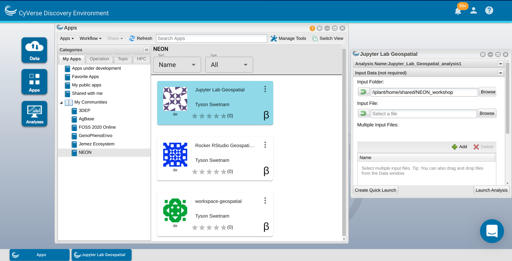

.. include:: cyverse_rst_defined_substitutions.txt
.. include:: custom_urls.txt

|CyVerse_logo|_

|Home_Icon|_
`Learning Center Home <http://learning.cyverse.org/>`_

Jupyter Lab, Desktop Environments, and Text Editors
---------------------------------------------------

**Description:**

Earlier in the workshop you launched a VICE image with RStudio. Follow the same process again using our Jupyter Lab Geospatial container instead.

We have integrated Project Jupyter's Data Science Jupyter Lab images with geospatial packages.

We have also integrated an all-in-one container which supports a desktop environment, Jupyter, VS Code (or your favorite text editors), and even RStudio. This container represents a 'Workspace' where you can do almost all of your daily data science tasks.

..
	#### Comment: short text description goes here ####

----

*Starting the VICE app*
~~~~~~~~~~~~~~~~~~~~~~~

**1.** Log into the Discovery Environment: `https://de.cyverse.org <https://de.cyverse.org>`_

**2.** Click one of our quick launch buttons:

   - Jupyter Lab Geospatial: |jupyterlab-geospatial|_
   - Workspace: |workspace-geospatial-latest|_

   Or, search using the |apps_button| 'Apps' search bar.

   query "jupyter lab geospatial" or "workspace geospatial" and see what comes up.

   Or, click the App button and a new window should open.

   Under "My Apps" section click on the "My Communities" section and "NEON" Group should appear

**3.** In the App Window you have a few options.

  **i.**   ``Analysis Name`` - you can change the name of the analysis if you like, the default name is typically ``<the-app-name>_analysis1``

   Your analysis will run, and when it completes, it will write any data that you have in the WORKING DIRECTORY of the container back to the Data Store in your Analyses folder, e.g. ``/iplant/home/<username>/analyses/<the-app-name>_analysis1-<DATE-TIME-of-job-starting>``

  **ii.** The second section is ``Input Data`` and has options for adding (1) a folder, (2) a single file, or (3) multiple files.

   For our use case today, we're going to add a folder from the data store.

  |add_data_window3|

   Add the path: ``/iplant/home/shared/NEON_workshop/``

  |add_data_window1|

  **iii.** The third section is ``Resource Requirements``, again you can leave the default settings.

   You can set the ``Minimum CPU`` to the minimum number of cores your app requires. If you do not select anything, the app will still be able to use multiple cores on the shared node on which it is deployed.

   You can set the ``Minimum RAM`` to the minimum number of GB of RAM you think your app requires.

   You can set the ``Minimum Disk Space`` to the minimum amount of scratch space you think your data will need.

   **iv.** After you've set the analysis name, input data, and resource requirements, click ``Launch Analysis``

Watch closely, you'll see a notification at the top of your screen and in the Bell icon in the upper right.

**4.** Open the |analyses_button| icon labeled "Analyses" to view your running analysis.

    Look for your App Name. See the square icon with an arrow pointed up to the right? Click on that icon and a new tab will open.

    |analyses_window|

    Alternately, click the Bell icon in the upper right to see your notifications, you should see 'Access your running analysis here.' as an option. Click on that link and a new tab will open.

**5.** Having clicked on either of the hyperlinked icons in Step 4 should result in a new tab opening in your browser.

   Your Discovery Environment Browser tab should still be open.

   The new URL for the instance has changed from ``https://de.cyverse.org/de/`` to something like ``https://af7664685.cyverse.run/``.

   This is a new instance is running a Virtual Machine for you on CyVerse cloud.

   You can now begin working in your running instance.

----

**Description of output and results**

You should now be ready to run the |NEON Python API tutorial|

Note, there are pre-completed ``.ipynb`` notebooks in the ``/tutorials`` folder which you added to the Instance when it was created. These should be in the working directory under the ``/NEON_workshop`` directory. You can use these for guidance, particularly if you fall behind.

----

**Fix or improve this documentation**

- Search for an answer:
  |CyVerse Learning Center|
- Ask us for help:
  click |Intercom| on the lower right-hand side of the page
- Report an issue or submit a change:
  |Github Repo Link|
- Send feedback: `learning@CyVerse.org <learning@CyVerse.org>`_

----

|Home_Icon|_
`Learning Center Home <http://learning.cyverse.org/>`_

.. Comment: Place Images Below This Line
   use :width: to give a desired width for your image
   use :height: to give a desired height for your image
   replace the image name/location and URL if hyperlinked

 .. |Clickable hyperlinked image| image:: ./img/IMAGENAME.png
    :width: 500
    :height: 100
 .. _CyVerse logo: http://learning.cyverse.org/

 .. |Static image| image:: ./img/IMAGENAME.png
    :width: 25
    :height: 25

.. Comment: Place URLS Below This Line

   # Use this example to ensure that links open in new tabs, avoiding
   # forcing users to leave the document, and making it easy to update links
   # In a single place in this document

   .. |Substitution| raw:: html # Place this anywhere in the text you want a hyperlink

      <a href="REPLACE_THIS_WITH_URL" target="blank">Replace_with_text</a>

.. |analyses_button| image:: ./img/de/analyses_icon.png
    :width: 25
    :height: 25

.. |apps_button| image:: ./img/de/apps_icon.png
    :width: 25
    :height: 25

.. |dots| image:: ./img/de/dots.png
    :width: 25
    :height: 25

.. |analyses_window| image:: ./img/de/analyses_window.png
    :width: 400

.. |analyses_options| image:: ./img/de/analyses_options.png
    :width: 150

.. |add_data_window1| image:: ./img/de/add_data_window1.png
    :width: 400

.. |workspace-geospatial-latest| image:: https://de.cyverse.org/Powered-By-CyVerse-blue.svg
.. _workspace-geospatial-latest: https://de.cyverse.org/de/?type=quick-launch&quick-launch-id=b19b3b00-0b6f-4c28-9d0f-23c965264309&app-id=580bbc6e-161e-11eb-880c-008cfa5ae621

.. |jupyterlab-geospatial| image:: https://de.cyverse.org/Powered-By-CyVerse-blue.svg
.. _jupyterlab-geospatial: https://de.cyverse.org/de/?type=quick-launch&quick-launch-id=63afd24c-9acc-4a8c-85ef-58b634a2ebc2&app-id=c940912c-fcea-11ea-b07f-008cfa5ae621

.. |NEON Python API tutorial| raw:: html

   <a href="https://www.neonscience.org/neon-api-01-introduction-requests" target="blank">NEON Python API tutorial</a>

.. |Github Repo Link|  raw:: html

   <a href="https://github.com/rbartelme/ag2pi_workshop" target="blank">Github Repo Link</a>
