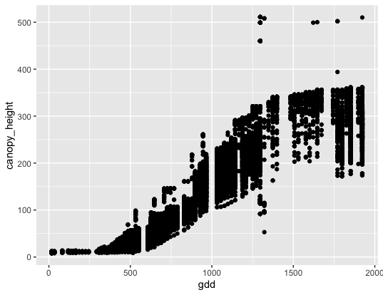
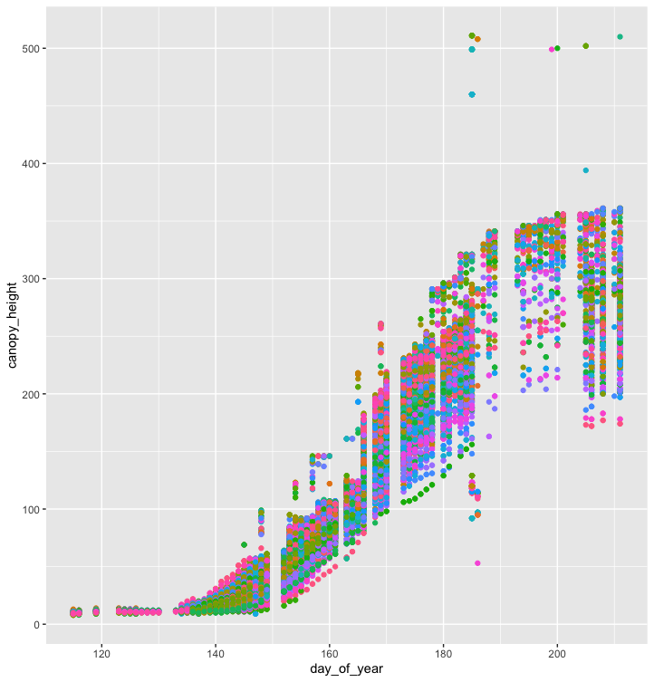
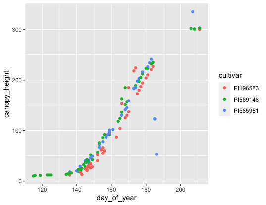
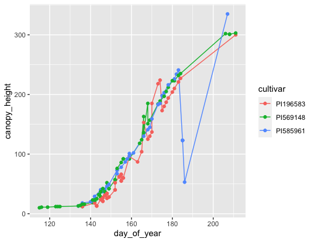

.. include:: cyverse_rst_defined_substitutions.txt
.. include:: custom_urls.txt

|CyVerse_logo|_

|Home_Icon|_
`Learning Center Home <http://learning.cyverse.org/>`_

**Introduction to R & RStudio**
===============================

**Why Learn R? What is RStudio?**
---------------------------------

|R| is a statistical programming language with many data science features.

Often, if there is a new statistical method, it is published as a tool for R users.

Learning R can help you if you decide to learn more languages in the future.

Most importantly for biologists, there is community support for scientific applications.

**Optional Local Setup**
------------------------

**Please note:** we will be running our code inside the CyVerse DE VICE App again: |rstudio-verse|
*These local installation instructions are for you to explore on your own time.*

1. You can download R & RStudio for your local:

   - Download |R|

   - Download |R Studio|

2. Follow installation instructions for your operating system.

3. Open RStudio.

Go to Session -> Set Working Directory to set where you will pull data files from and/or save your code.

.. code-block:: R
	setwd(path)
	getwd() #see what working directory you're in

**Introduction**
----------------

You will learn how to:
- navigate & interact with R Studio
	- UI of R Studio
	- how to use "help"
	- install packages
	- upload data
- data structures
	- strings, factors, numbers, integers
	- vectors & arrays
	- matrices & lists
- explore data
	- data manipulation
	- data subsetting

R Studio makes using R programming language easier to interact with and to keep track of projects.

**Navigating & Interacting with R Studio**
------------------------------------------

Basic Layout
~~~~~~~~~~~~

|R Console|

The basic layout includes:
- Interactive R Console (left) <- most of your time will be spent here
- Environment/History (upper right)
- Files/Plots/Packages/Help/Viewer (lower right)

Once you open a new R script (File -> New File -> R Script), and editor panel should appear in the upper left.
R scripts are saved as .R files.
These can be rearranged by going into Preferences.

Calculating with R
~~~~~~~~~~~~~~~~~~

**Note** spaces don't matter unless it's in the middle of an argument

**Note** R starts counting at 1, not at 0

Using R as a calculator

.. code-block:: R

	> 2+2
	> 4

	> 1 +
	> + #R will let you know that the code is incomplete

	> 2/10000
	> 2e-04

**Exercise:**

	1. What is the output for 5e3?
	2. How would you add 5 and 3 and multiply the sum by 2?

Comparing things: Using logical operators

.. code-block:: R

	> 1 == 1 #spaces between logical arguments matter
	> TRUE

	> 1 < 2
	> TRUE

	> 1 >= 9
	> FALSE

Other logical conditions: ``&``, ``|``, ``!``

HELP!
~~~~~

help() is the most useful function in R. You will likely use this and Stack Overflow to help solve most of your problems (not life problems, you're on your own for that).

.. code-block:: R

	help(plot)

Parts of the help file:
- Description
	This describes what the function does.

- Usage
	This describes the formula and arguments for the function

- Arguments
	These are different inputs into the function that can be used.
	The argument (e.g., x, y) do not always need to be specified.
	For example,

.. code-block:: R

	plot(x = data.x, y = data.y)
	plot(data.x, data.y)

are the same thing.

- Details
	Usually these state the outputs of the function, or any other nuance within the function that may not be obvious.

- See also
	This will link to similar functions, or functions that can be called with this function.

- Examples
	Some are better than others. Generally, though, this gives examples of the arguments most commonly used in the function.

Searching for help:
- type in error message (just delete words specific to your data)
- inlcude in package name
- type "CRAN" after to help search for R programming specifically

Installing packages
~~~~~~~~~~~~~~~~~~~

.. code-block:: R

	install.packages("packageName")

To install more than one package at once you can use the ``c("package1", "package2")`` concatenate:

.. code-block:: R

	install.packages(c("package1", "package2"))

Often installing a package will install its dependencies as well. You can set the dependency installation by hand using:

.. code-block:: R

	install.packages("packageName", dependencies=TRUE)
	install.packages(c("package1", "package2"), dependencies=TRUE)

You can see installed packages with the following command:

.. code-block:: R

	installed.packages()

To use the package after it's been loaded:

.. code-block:: R
	#both do the same thing:
	require("package") #loads dependencies; will give a warning if it is in conflict with another package (e.g., masks)
		#can overwrite masked functions using "::" (e.g., package::function)
	library("package") #will give an error if in conflict with other packages or has missing dependencies

Loading Data
~~~~~~~~~~~~

There are many ways to load data in the R environment depending on the document type you have.

.. code-block:: R

	#General reading
	read.table("dataFile.txt", sep = "\t")

**Exercise:**

	1. What are the arguments for read.table?
	2. What arguments would you use to upload a .csv file using ``read.table()``?

.. code-block:: R

	#.csv files
	read.csv()

	#reading in from an online source or path to the directory if you're not in the right working directory
	read.table(path/to/file)

**Data Structures**
-------------------

Types of Variables
~~~~~~~~~~~~~~~~~~

Character - text that cannot have calculations done on them
	e.g., "a", "xyz"

.. code-block:: R

  as.character()

Numeric - numerical values include decimals and can have calculations performed on them
	e.g., 1, 1.5

.. code-block:: R

  as.numeric()

Integer - whole numbers only, and can also have calculations performed on them
	e.g., 2L (L stores it as an integer)

.. code-block:: R

  as.integer()

Logical - TRUE or FALSE

.. code-block:: R

  as.factor()
	#creates groupings within dataset

**Exercise:**

	1. What does the following return? What does it mean?

.. code-block:: R

	str(10)
	str("10")

Try calculations on the following.
	2. What works and what doesn't? Why or why not?

.. code-block:: R

	10*2
	"10"*2

Errors v. Warnings:
	Errors are given when R cannot perform the calculation
	Warnings mean that the function has run but perhaps with some issues.

Storing Variables
~~~~~~~~~~~~~~~~~

We can assign any of the types of data above in a "place holder".
Variables are assignee using "<-".

For example, we can store the number 10 in a letter to use later

.. code-block:: R

	a <- 10

**NOTE** Do not create variables that are already functions or arguments (e.g., c, T, F).
**NOTE** Do not overwrite variables.

**Exercise:**

	1. What does a*2 give you?

Vectors
~~~~~~~

Vectors are 1-D object that contain "*like*" data types.
You can create a string of variables and add to a vector using c(), which is short for concatenate.

**Exercise:**

	1. What are the outputs of the code below?
	2. Create your own vector using the vector() function.

.. code-block:: R

	x <- c(1, 2, 3, 4, 5)
	y <- 1:5
	z <- seq(1, 5, 1)

3. Are x, y, and z all the same structure? If not, how would you make them all the same?

Adding to vectors: the concatenate function: c()

.. code-block:: R

	d <- 1
	d <- c(d, 2)

Try adding two to every numer in the vector "x".
	3. How do you add two to every number in x?

What happens what you add a character to a vector?

.. code-block:: R

  d <- c(d, "a")
	str(d)

**ATOMIC VECTORS** are vectors which cannot be simplified anymore, and therefore "$" cannot be used on them. Yes, this error happens a lot. Yes, it is frustrating. Good luck.

Matrices & Dataframes
~~~~~~~~~~~~~~~~~~~~~

A matrix and a dataframe are both 2-D objects that are made up of vectors.

Creating a dataframe using data.frame()

**Exercise:**

	1. Play with the different types of data in the data.frame(). What happens?

You can combine dataframes:

.. code-block:: R

	hello <- data.frame(1:26, letters, words = c("hey", "you"))
	hi <- data.frame(1:26, letters, c("hey", "you"))
	howdy <- data.frame(hello, hi)

How do you name the column with the numbers 1-26?

.. code-block:: R

  hi <- data.frame(numbers = 1:26, letters, c("hey", "you"))

What are the column headers?
What happens when you do the following?

.. code-block:: R

  hola <- data.frame(1:26, letters, words = "hey", "you")

Adding columns and rows using cbind() and rbind()

.. code-block:: R

	cbind(hello, "goodbye")

We can call columns using **$** in the form of *data.frame$column* or call them using the modifier *data.frame[row#, column#]*

Calling columns:

.. code-block:: R

	hello[,2] #[] are like an index
	hello$letters

Subsetting:

.. code-block:: R

	hello[1:5, 2]
	hello$letters[1:5]

**Useful Functions to explore data types**

.. code-block:: R

	View()  #can also double click on dataframe inside the R environment tab
	str()
	summary()
	class()
	typeof()
	length()
	attributes() #can also click on dataframe inside the R environment tab
	dim()
	head()
	tail()

**Exercise**

	1. What is the output of these commands on the data frame hello?

You can save a dataframe using write.table() and write.csv().

The R Environment
~~~~~~~~~~~~~~~~~

You can view your environment either by looking at the upper left tab or by typing the following:

.. code-block:: R

	ls() #see variables in your environment

You can remove objects using the rm() function.

Exercise:

	1. How would you remove "a" from the environment? How would you check?

**Exploring Data**
------------------

R is a great tool for exploratory data analysis (EDA), and RStudio makes EDA even easier!

Data Manipulation
~~~~~~~~~~~~~~~~~

Create the following dataframe:

.. code-block:: R

	cats <- data.frame(coat = c("calico", "black", "tabby"),
                    weight = c(2.1, 5.0,3.2),
                    likes_string = c(1, 0, 1))
	class(cats)

Let's add!

.. code-block:: R

	cats$weight + 2
	cats$coat + cats$coat

What are the outputs?

We can use the function "paste" to make more complex strings:

.. code-block:: R

	paste("My cat is", cats$coat)

What is the output?

Subsetting Data
~~~~~~~~~~~~~~~

**Exercise:**

	1. What is the function for subsetting data?
	2. What are the outputs?

.. code-block:: R

  p <- subset(cats, cats$weight <= 3)
	p

	q <- cats[cats$weight <= 3,]
	q

	cats$likes_string == 1
	cats[cats$likes_string == TRUE,]

	cats[c(1,3),]
	cats[colnames(cats) == "weight"]
	cats[cats$weight >= 2 & cats$weight <= 5]
	cats[cats$likes_string != 0,] #not equal to
	cats[!(is.na(cats$weight))] #is not

.. code-block:: R

	x <- c(a=5.4, b=6.2, c=7.1, d=4.8, e=7.5) # we can name a vector 'on the fly'
	#x is a vector
	x[c(a,c),]
	x[names(x) == "a"]
	x[names(x) == "a" | "c"]
	x[names(x) != "a"]

**Making Figures**
------------------

Here we will learn:

-How to plot using ggplot2
-How to subset data with dplyr
-Basic data summaries
-Writing Files from an Analysis
-Generating plots for publications

Publication Quality Figures with ggplot2
~~~~~~~~~~~~~~~~~~~~~~~~~~~~~~~~~~~~~~~~

Plotting our data is one of the best ways to quickly explore it and the various relationships between variables.
There are three main plotting systems in R, the **base plotting system**, the **lattice package**, and the **ggplot2** package.
Today we’ll be learning about the ggplot2 package, because it is the most effective for creating publication quality graphics.
ggplot2 is built on the grammar of graphics, the idea that any plot can be expressed from the same set of components: a data set, a coordinate system, and a set of geoms – the visual representation of data points.
The key to understanding ggplot2 is thinking about a figure in layers. This idea may be familiar to you if you have used image editing programs like Photoshop, Illustrator, or Inkscape.

The data used in this lesson were collected as part of the `TERRA REF <https://www.terraref.org/>`_ Project.
Let’s start off with an example. We will plot some *Sorghum bicolor* phenotype data.
We'll look at how Growing Degree Days (gdd) compares to canopy height:

.. code-block:: R

  #load the library
  library("ggplot2")
  #load the dataset
  mac_season6 <- read.table("~/input/ag2pi_workshop/ag-data/season6_cleaned.txt", sep = "\t",
    header = TRUE, stringsAsFactors = FALSE)
  #plot the data
  ggplot(data = mac_season6, mapping = aes(x = gdd, y = canopy_height)) +
    geom_point()

|raw ggd canopy_height|

**Note:** the ``ggplot()`` function alone isn't enough to draw a figure.

.. code-block:: R

  ggplot(data = mac_season6, mapping = aes(x = gdd, y = canopy_height))

We need to explicitly tell ``ggplot()`` how to visualize the data with a "geom" layer.

In the first example we used ``geom_point()``\ , which tells ``ggplot()`` we want to generate a scatter plot.

**Exercise:**

Modify the example above so that the figure shows canopy_height vs. day_of_year.

What if we want to color our plot by a group? In this case, let's try coloring the plot by the *Sorghum bicolor* cultivar.

.. code-block:: R

  ggplot(data = mac_season6, mapping = aes(x=day_of_year, y=canopy_height, by=cultivar)) +
    geom_point(mapping = aes(color = cultivar), show.legend = FALSE)

|plot day of year colorized|

It seems impractical to visualize hundreds of cultivars of *S. bicolor* on a single plot.

Let's look at another handy tool from Tidyverse, the R ecosystem that ggplot2 belongs to.

We will use the dplyr library to pick 3 cultivars of interest.
The power of dplyr comes from its ability to use the ``%>%``, or pipe, to combine functions.

Let's try using just the select command:

.. code-block:: R

  #load the dyplr library
  library(dplyr)
  s6_subset <- select(mac_season6, day_of_year, gdd, cultivar, canopy_height)

Now the problem with our subsetted data is it has less variables, but it still has all the cultivars!
We want to make a clean looking plot of our favorite cultivars for our publication.
This is where the pipe comes in handy, but we'll need to make a character vector to use with the filter command as well to get our results.

.. code-block:: R

  s6_favorites <- c("PI569148", "PI585961", "PI196583")
  s6_figure_data <- mac_season6 %>%
    filter(cultivar == s6_favorites) %>%
    select(day_of_year, gdd, cultivar, canopy_height)

Now that we have our data in an even smaller subset, let's make a nice looking plot with it.

.. code-block:: R

  ggplot(data = s6_figure_data, mapping = aes(x=day_of_year, y=canopy_height, by=cultivar)) +
    geom_point(mapping = aes(color = cultivar), show.legend = TRUE)

|subset scatterplot|

But wait...that looks really sparse with the scatterplot. Let's combine a few different geoms to make something nicer.

.. code-block:: R

  ggplot(data = s6_figure_data, mapping = aes(x=day_of_year, y=canopy_height, by=cultivar)) +
    geom_line(mapping = aes(color = cultivar), show.legend = TRUE) +
    geom_point(mapping = aes(color = cultivar))

|subset lineplot|

Now we can report on why PI585961 is so strange compared to the other two cultivars which follow normal growth curves.

Let's use dplyr to summarize our measurements in a few ways:

.. code-block:: R

  height_mean_summary <- s6_figure_data %>%
    group_by(cultivar) %>%
    summarize(mean_height = mean(canopy_height))

You'll see the message:

.. code-block:: R

  `summarise()` ungrouping output (override with `.groups` argument)

But if you type in the variable name, height_mean_summary, you should see something like the following:

.. code-block:: R

 > height_mean_summary
    # A tibble: 3 x 2
      cultivar mean_height
      <chr>          <dbl>
    1 PI196583        82.9
    2 PI569148        90.0
    3 PI585961       109.

Well that's really strange that the mean height of PI585961 is so inflated.
Let's look at the standard error of the measurements, which is calculated as follows:

.. code-block:: R

  height_se_summary <- s6_figure_data %>%
    group_by(cultivar) %>%
    summarize(se_height = sd(canopy_height)/sqrt(n()))

The standard error doesn't look too strange though:

.. code-block:: R

  > height_se_summary
  # A tibble: 3 x 2
     cultivar    se_height
     <chr>          <dbl>
  1 PI196583        10.1
  2 PI569148        11.4
  3 PI585961        11.9

However, standard error of the mean only measures how far the data is from the "true population mean".
If we look at the mean, standard deviation, and standard error, we can see a different story in the data.

.. code-block:: R

  height_summary <- s6_figure_data %>%
    group_by(cultivar) %>%
    summarize(mean_height = mean(canopy_height),
              sd_height = sd(canopy_height),
              se_height = sd(canopy_height)/sqrt(n()))

.. code-block::

  > height_summary
    #  A tibble: 3 x 4
      cultivar mean_height sd_height se_height
      <chr>          <dbl>     <dbl>     <dbl>
    1 PI196583        82.9      75.6      10.1
    2 PI569148        90.0      90.0      11.4
    3 PI585961       109.       75.9      11.9

So now we have some summaries, but there are still some outliers in the plot.
When you discuss these outliers with your group it turns out that there was an error in sample collection,
but you caught it with your new data visualization skills.

Let's write out this tibble, similar to a data frame, but it's TidyVerse specific,
so let's convert this summary to a data farme and export the data to discuss the anomalous data with our research group.

.. code-block:: R

  # convert from tibble to a data frame
  height_df_summary <- as.data.frame(height_summary)
  # write out dataframe as a csv file, row.names = FALSE gets rid of row numbers
  write.csv(x = height_df_summary, file = "~/input/ag2pi_workshop/ag-data/height_summary.csv", row.names = FALSE)

**Note:** this dataset doesn't actually contain a real error.
There are other variables that we did not visualize today.
However, this is the power of visualizing data, and the R language gives access to statistical functions for outlier data detection.

Let's write the plot out that we made before and this is what we want for Figure 1 of our paper.

.. code-block:: R

  #replot the data and store it as a variable
  figure1 <- ggplot(data = s6_figure_data, mapping = aes(x=day_of_year, y=canopy_height, by=cultivar)) +
              geom_line(mapping = aes(color = cultivar), show.legend = TRUE) +
              geom_point(mapping = aes(color = cultivar))

  #save the plot as a png file (can also specify PDF)
  ggsave(filename = "~/input/ag2pi_workshop/ag-data/figure1.png", plot = figure1)

And now we have our plot for our manuscript saved in the ``ag-data`` folder.

----

Revisiting iRODS
~~~~~~~~~~~~~~~~

Lets open the terminal again to write our files to the CyVerse Data Store, in your own directory.

Configure iRODS with ``iinit``:

.. code-block::

  iinit

The following are the inputs for the iinit fields:

.. code-block::

  Enter the host name (DNS) of the server to connect to: data.cyverse.org
  Enter the port number: 1247
  Enter your irods user name: your_cyverse_user_name
  Enter your irods zone: iplant
  Those values will be added to your environment file (for use by
  other iCommands) if the login succeeds.

  Enter your current iRODS password: your_cyverse_password

Now that we've configured iRODS let's see where we are with ``ils``

.. code-block::

  ipwd
  /iplant/home/your_cyverse_user_name

If for whatever reason you're not in your user directory ``icd`` without an argument will get you back there.

Now we can create a directory, let's call it ``ag2pi_checkout``

.. code-block::

  imkdir ag2pi_checkout

We can "put" our file from this analysis onto the datastore by doing the following:

..code-block::

  cd ~/input/ag2pi_workshop/ag-data/
  iput -KPvf height_summary.csv ag2pi_checkout
  iput -KPvf figure1.png ag2pi_checkout

----

Where to from here?
~~~~~~~~~~~~~~~~~~~

**R specific tips:**

* Look into logic and loops within the |Control Flow| exercise.
* Generally the |R Repro| is a good resource.
* If you want to try using shell functions inside of R Scripts, look up the functions: ``system()`` and ``system2()``

Some good resources for help coding are:

* |Stack Overflow|
* |RStudio Community|
* |Medium|

Additional organizations that offer other coding workshops:

* |CyVerse FOSS|
* |The Carpentries|

.. CHEAT SHEETS::
   RStudio provides numerous `"cheat sheets" <https://www.rstudio.com/resources/cheatsheets/>`_ which help learners.
   `2019 Package Cheat Sheets <https://www.rstudio.com/wp-content/uploads/2019/01/Cheatsheets_2019.pdf>`_

----

*Lesson content modified from The Carpentries: R for Reproducible Scientific Analysis*
       |R Novice Gapminder|

Under The Carpentries License:
       |Carpentries License|

----

--------------
**Fix or improve this documentation:**
- On Github: |Github Repo Link|
- Send feedback: `Tutorials@CyVerse.org <Tutorials@CyVerse.org>`_
--------------

.. |Control Flow| raw:: html

  <a href="https://swcarpentry.github.io/r-novice-gapminder/07-control-flow/" target="blank">Software Carpentries Control Flow</a>

.. |R Repro| raw:: html

  <a href="https://swcarpentry.github.io/r-novice-gapminder/" target="blank">R for Reproducible Scientific Analyses</a>

.. |Medium| raw:: html

  <a href="https://www.medium.com/" target="blank">Medium</a>

.. |Stack Overflow| raw:: html

  <a href="https://www.stackoverflow.com/" target="blank">StackOverflow</a>

.. |The Carpentries| raw:: html

  <a href="https://carpentries.org/" target="blank">The Carpentries</a>

.. |CyVerse FOSS| raw:: html

  <a href="https://cyverse.org/fossonline" target="blank">CyVerse FOSS Online</a>

.. |RStudio Community| raw:: html

  <a href="https://community.rstudio.com/" target="blank">RStudio Community</a>

.. |R Novice Gapminder| raw:: html

   <a href="http://swcarpentry.github.io/r-novice-gapminder/" target="blank">The Carpentries Tutorial Link</a>

.. |Carpentries License| raw:: html

   <a href="http://swcarpentry.github.io/r-novice-gapminder/LICENSE.html" target="blank">R for Reproducible Scientific Analysis: Licenses</a>

.. |R Console| image:: ./img/rstudio.png
    :width: 750

.. |Github Repo Link|  raw:: html

   <a href="https://github.com/CyVerse-learning-materials/foss-2019/tree/master/software_essentials/R_Studio.rst" target="blank">Github Repo Link</a>

.. |R| raw:: html

   <a href="https://cran.r-project.org/" target="blank">R</a>

.. |RStudio| raw:: html

   <a href="https://www.rstudio.com/products/rstudio/download/#download" target="blank>RStudio</a>

.. |rstudio-verse| image:: https://de.cyverse.org/Powered-By-CyVerse-blue.svg
.. _rstudio-verse: https://de.cyverse.org/de/?type=quick-launch&quick-launch-id=97782f8c-8c6f-4969-8c4e-2dd9d5bf5f96&app-id=a8b21a2c-e6f4-11ea-844a-008cfa5ae621
